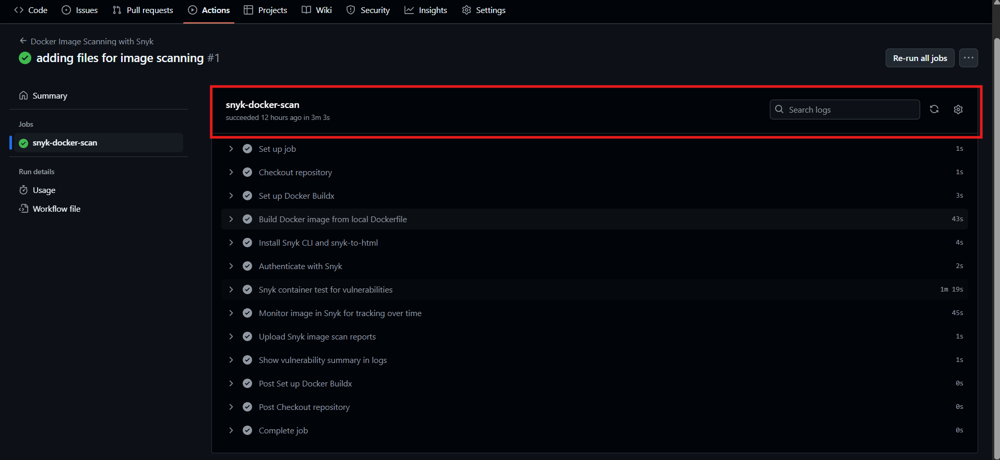

# 🛡️ Docker Image Scanning with Snyk — Technical Documentation

## 1. Context: Why We Are Doing This

As containerized applications become the standard, it's critical to secure the images used to deploy them. Image scanning ensures vulnerabilities in the base image, dependencies, and libraries are identified **before they reach production**.

This assignment demonstrates how to:

- Build a Docker image locally from the project's Dockerfile.
- Scan the image using **Snyk** to detect vulnerabilities.
- Monitor and track historical vulnerabilities with `snyk monitor`.
- Export and upload scan reports as artifacts.
- Integrate this as a GitHub Actions CI pipeline.

---

## 2. Tool Selection & Thought Process

✅ **Selected Tool:** Snyk (Community Tier)

| Tool         | Reason for Rejection/Selection                                  |
|--------------|------------------------------------------------------------------|
| Trivy        | Excellent, but Snyk offers more granular reporting via HTML.     |
| Clair/Grype  | Good, but more effort needed for HTML report/export.             |
| Docker Scout | New and limited in reporting customization (Community version).  |
| **Snyk**     | Easy to use, integrates well with GitHub Actions, supports JSON+HTML reports, and includes `monitor` tracking. ✅ |

**CI Tool Used:** GitHub Actions  
**Dockerfile Location:** Root of the repository

---

## 3. Docker Image Scanning GitHub Actions Pipeline

### 🛠️ Trigger Conditions

- On push to `main`
- On pull request to `main`

### 🔧 Pipeline Overview

```yaml
name: Docker Image Scanning with Snyk

on:
  push:
    branches: [main]
  pull_request:

jobs:
  snyk-docker-scan:
    runs-on: ubuntu-latest
    permissions:
      contents: read

    steps:
      - name: Checkout repository
        uses: actions/checkout@v3

      - name: Set up Docker Buildx
        uses: docker/setup-buildx-action@v2

      - name: Build Docker image from local Dockerfile
        run: |
          docker build -t my-app:latest .

      - name: Install Snyk CLI and snyk-to-html
        run: npm install -g snyk snyk-to-html

      - name: Authenticate with Snyk
        run: snyk auth ${{ secrets.SNYK_TOKEN }}

      - name: Snyk container test for vulnerabilities
        run: |
          snyk container test my-app:latest --file=Dockerfile --json > snyk-image-report.json || true
          snyk container test my-app:latest --file=Dockerfile --json | snyk-to-html -o snyk-image-report.html || true
        env:
          SNYK_TOKEN: ${{ secrets.SNYK_TOKEN }}

      - name: Monitor image in Snyk for tracking over time
        run: snyk container monitor my-app:latest --file=Dockerfile
        env:
          SNYK_TOKEN: ${{ secrets.SNYK_TOKEN }}

      - name: Upload Snyk image scan reports
        uses: actions/upload-artifact@v4
        with:
          name: snyk-image-scan-reports
          path: |
            snyk-image-report.json
            snyk-image-report.html

      - name: Show vulnerability summary in logs
        run: |
          echo "=== Snyk Image Vulnerability Summary ==="
          if [ -s snyk-image-report.json ]; then
            jq -r '.vulnerabilities[] | "\(.severity | ascii_upcase): \(.title) (\(.packageName)@\(.version))"' snyk-image-report.json
          else
            echo "✅ No vulnerabilities found or scan failed."
```
## Github Action pipeline 



## Artifact Upload Section 


## Synk Html Report


## Synk dashboard view


## 4. Vulnerability Summary

| Severity | Count (approximate) |
|----------|---------------------|
| Critical | 23                   |
| High     | 159                  |
| Medium   | 245                  |
| Low      | 310                   |
| **Total**| **737**              |

Reports include:

- Vulnerable packages & versions  
- Severity level  
- CVE IDs  
- Suggested fixes  

---

## 5. Recommended Mitigations

- Update base image to a more secure version (e.g., `alpine:3.19+`).
- Replace packages that do not have security patches.
- Monitor image regularly using `snyk monitor`.
- Enable Snyk PR checks to prevent regressions.

📌 **Example:**

```json
{
  "package": "libcurl",
  "severity": "critical",
  "remediation": "Upgrade base image or patch libcurl manually."
}
```
## 6. Impact Analysis & Challenges

### ✅ Benefits

- Finds vulnerabilities **before merge**.
- Enables `snyk monitor` for continuous security insight.
- JSON + HTML reports for automation and manual review.
- Docker-native scanning — no need to push to a registry.
- CI-integrated and fully automated.

### 🧠 Challenges & Solutions

| Challenge                          | Solution                                                |
|-----------------------------------|---------------------------------------------------------|
| `snyk` command not found          | Installed globally using `npm install -g snyk`.         |
| HTML report empty or not generated| Handled with fallback + validation using `|| true`.     |
| Pipeline fails on vulnerabilities | Made test steps non-blocking for assignment/demo.       |
| Docker Hub push not allowed       | Replaced with local image scanning (no registry needed) |

---

## 7. Conclusion

Integrating Docker image scanning with **Snyk** into GitHub Actions enhances your CI/CD pipeline with strong container security capabilities:

- Provides fast, continuous vulnerability feedback.
- Eliminates manual effort via automation.
- Ensures secure-by-default builds.
- Produces evidence (artifacts) for compliance and audits.

🚀 This implementation helps enforce **DevSecOps** practices for containerized apps.

---

## 🗂️ Additional Files

| File Name                           | Description                                   |
|------------------------------------|-----------------------------------------------|
| `.github/workflows/snyk-docker.yml`| CI pipeline for Docker image scanning         |
| `snyk-image-report.json`           | JSON vulnerability report                     |
| `snyk-image-report.html`           | HTML vulnerability summary                    |
| `README.md`                        | Instructions and explanation                  |
