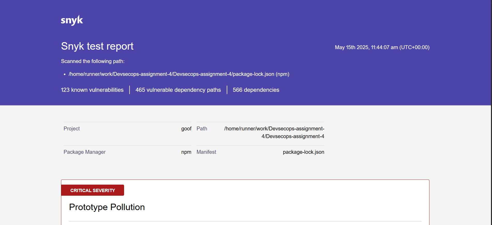
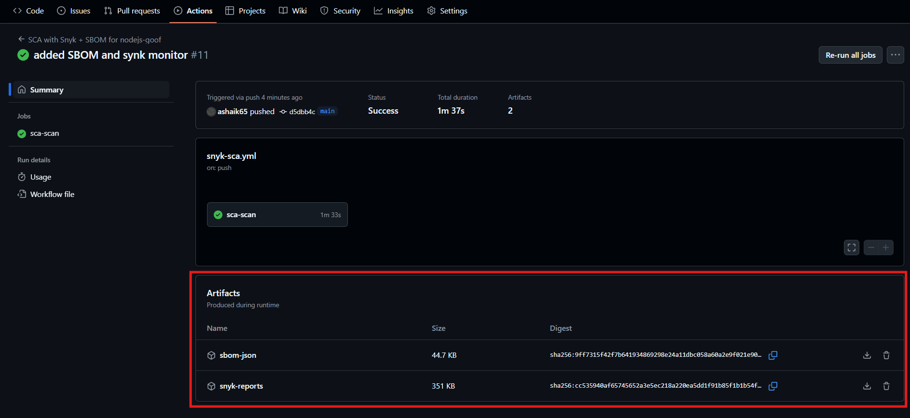

# 🔍 Software Composition Analysis (SCA) in CI/CD Pipeline — Technical Documentation

## 1. Context: Why We Are Doing This

In today’s development environment, most applications rely heavily on open-source libraries. Software Composition Analysis (SCA) ensures we can identify and mitigate vulnerabilities in these dependencies, especially transitive ones, early in the software development lifecycle.

This implementation helps to:

- Detect known vulnerabilities in direct and transitive dependencies.
- Ensure compliance with license and security standards.
- Prevent high-risk components from reaching production.

---

## 2. Tool Selection & Thought Process

✅ Selected Tool: Snyk (Community Tier)

We evaluated multiple tools from the assignment list:

| Tool                 | Reason for Rejection/Selection                        |
|----------------------|------------------------------------------------------|
| OWASP Dependency Check| Too slow and consumes GitHub Action minutes.         |
| Mend, Black Duck, JFrog Xray | Paid/Enterprise-oriented, license constraints.   |
| Snyk                 | Fast, free for small projects, JSON/HTML reporting support. ✅ |

**CI Tool Used:** GitHub Actions  
**Repository Used:** nodejs-goof

---

## 3. SCA GitHub Actions Pipeline

### 🛠️ Trigger Conditions

- On push to `main`  
- On pull request to `main`

### 🔧 Workflow Configuration (Snyk + SBOM Integration)

```yaml
name: SCA with Snyk + SBOM for nodejs-goof

on:
  push:
    branches: [main]
  pull_request:

jobs:
  sca-scan:
    runs-on: ubuntu-latest
    permissions:
      contents: read

    steps:
      - name: Checkout code
        uses: actions/checkout@v3.5.3

      - name: Set up Node.js
        uses: actions/setup-node@v3.8.1
        with:
          node-version: '16'

      - name: Install dependencies
        run: npm install

      - name: Run Snyk test (console output)
        uses: snyk/actions@master
        with:
          command: test
        env:
          SNYK_TOKEN: ${{ secrets.SNYK_TOKEN }}
        continue-on-error: true

      - name: Install Snyk CLI and snyk-to-html
        run: |
          npm install -g snyk snyk-to-html

      - name: Generate Snyk HTML and JSON Reports
        run: |
          snyk test --json > snyk-report.json || true
          snyk-to-html -i snyk-report.json -o snyk-report.html || true

          echo "Report files:"
          ls -lh snyk-report.*

          if [ -s snyk-report.html ]; then
            echo "✅ HTML report generated"
          else
            echo "❌ HTML report was not generated correctly"
          fi
        env:
          SNYK_TOKEN: ${{ secrets.SNYK_TOKEN }}
        continue-on-error: true

      - name: Monitor project with Snyk
        run: snyk monitor || true
        env:
          SNYK_TOKEN: ${{ secrets.SNYK_TOKEN }}

      - name: Upload Snyk reports
        uses: actions/upload-artifact@v4
        with:
          name: snyk-reports
          path: |
            snyk-report.json
            snyk-report.html

      # --- SBOM Generation and Scan using Docker ---

      - name: Generate SBOM using Syft (CycloneDX JSON)
        run: |
          docker run --rm -v ${{ github.workspace }}:/project anchore/syft:latest /project -o cyclonedx-json > sbom.json || true

      - name: Scan SBOM with Grype
        run: |
          docker run --rm -v ${{ github.workspace }}:/project anchore/grype sbom:/project/sbom.json -o table || true

      - name: Upload SBOM Artifact
        uses: actions/upload-artifact@v4
        with:
          name: sbom-json
          path: sbom.json

```

## A: Successful GitHub Actions Run (All Steps Visible)


## B: HTML Report Rendered View



## C: Uploaded Artifacts Section in GitHub Actions




## 4. Vulnerability Summary

| Severity | Count (approximate) |
|----------|---------------------|
| Critical | 10                  |
| High     | 45                  |
| Medium   | 38                  |
| Low      | 30                  |
| **Total**| **123**             |

Reports include package name, vulnerable versions, CVE ID, and recommended remediation.

---

## 5. Recommended Mitigations

- Upgrade vulnerable packages as suggested in the Snyk report.
- Replace libraries with no patches with maintained alternatives.
- Regularly scan codebase and enable Snyk PR checks for ongoing coverage.

📌 **Example**:

```json
{
  "package": "minimist",
  "severity": "high",
  "remediation": "Upgrade to version >=1.2.3"
}
```

## 6. Impact Analysis & Challenges

### ✅ Benefits

- Identifies risks before merge to `main`.
- JSON + HTML reports enable both automation and manual review.
- Snyk monitor enables historical vulnerability tracking.
- SBOM generation supports SBOM-based security compliance (CycloneDX).
- Dockerized tools reduce setup issues in CI.
- Non-blocking pipeline — vulnerabilities don’t break builds.

---

### 🧠 Challenges & Solutions

| Challenge                          | Solution                                                  |
|-----------------------------------|-----------------------------------------------------------|
| `snyk` command not found          | Installed globally using `npm install -g snyk`.           |
| Artifact uploaded but empty       | Handled empty report with validation and `|| true`.       |
| Pipeline failure due to vulnerabilities | Made Snyk scan non-failing for the assignment demo. |
| Syft/Grype install errors         | Used Docker-based containers instead of manual binaries.  |

---

## 7. Conclusion

SCA with Snyk and SBOM-based scanning in GitHub Actions provides a robust, scalable solution to:

- Automate vulnerability identification and mitigation.
- Maintain compliance with open-source usage policies.
- Build security into CI/CD without slowing teams down.

🚀 This implementation enables secure-by-default development workflows and delivers artifact-based evidence for audit and reporting.

---

## 🗂️ Additional Files

| File Name                         | Description                              |
|----------------------------------|------------------------------------------|
| `.github/workflows/sca-snyk.yml` | CI pipeline with Snyk + SBOM integration |
| `snyk-report.json`               | JSON vulnerability report                |
| `snyk-report.html`               | HTML vulnerability summary               |
| `sbom.json`                      | CycloneDX JSON SBOM report               |
| `README.md`                      | Instructions and explanation             |
